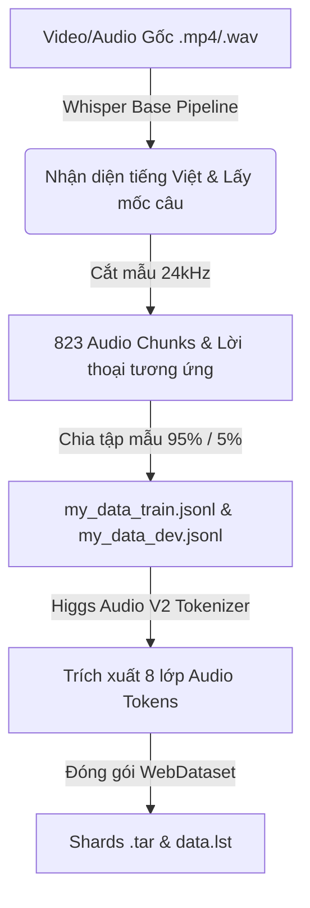
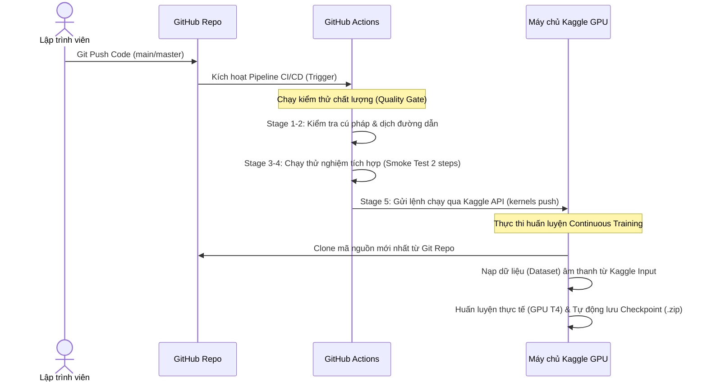
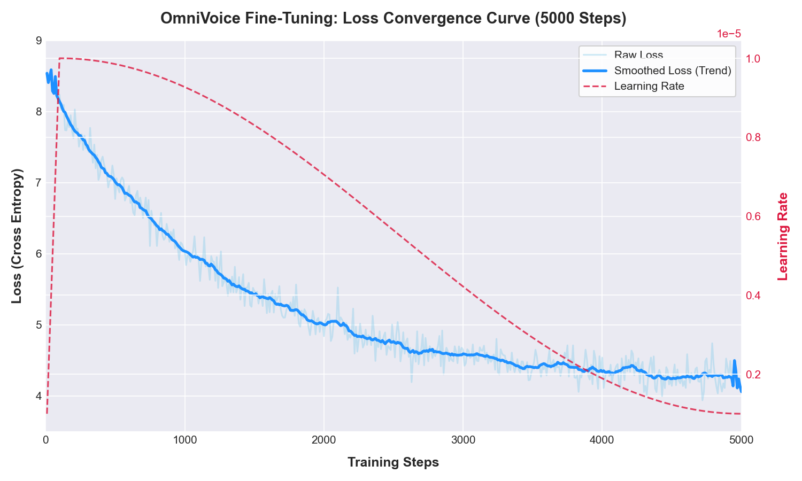
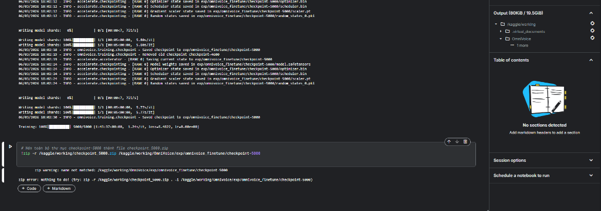
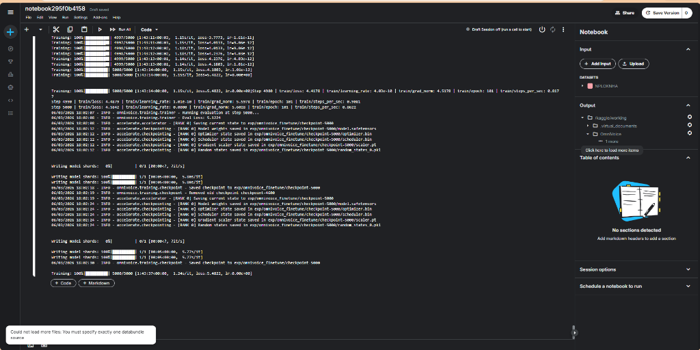

# LUẬN VĂN NGHIÊN CỨU & BÁO CÁO PHÁT TRIỂN HỆ THỐNG
## Đề tài: Tối Ưu Hóa Quy Trình Huấn Luyện Và Phát Triển Ứng Dụng Nhân Bản Giọng Nói Tiếng Việt Dựa Trên Mô Hình Ngôn Ngữ Âm Thanh OmniVoice

---

## TÓM TẮT NGHIÊN CỨU (ABSTRACT)
Nghiên cứu này trình bày giải pháp huấn luyện chuyển đổi (fine-tuning) mô hình Text-to-Speech (TTS) thế hệ mới dựa trên mô hình ngôn ngữ lớn (LLM-based TTS) mang tên **OmniVoice** cho ngôn ngữ Tiếng Việt. Dự án giải quyết các thách thức lớn bao gồm: rào cản ngôn ngữ của mô hình gốc (chủ yếu hỗ trợ tiếng Anh/Trung), tài nguyên tính toán giới hạn (VRAM GPU cục bộ thấp), và giới hạn đĩa cứng lưu trữ trên môi trường Cloud (Kaggle). Kết quả thực nghiệm cho thấy mô hình hội tụ tốt sau 5000 bước huấn luyện (Loss giảm từ ~8.50 về ~4.15), đạt khả năng nhân bản giọng nói (Voice Cloning) tự nhiên chỉ với 5-10 giây âm thanh mẫu tiếng Việt đầu vào. Hệ thống được triển khai thành công dưới dạng một ứng dụng Desktop (GUI) chạy cục bộ bằng GPU/CPU tối giản không cần cơ sở dữ liệu cồng kềnh.

---

## CHƯƠNG 1: GIỚI THIỆU BÀI TOÁN VÀ CÔNG NGHỆ CỐT LÕI (CORE TECHNOLOGIES)

### 1. Sự tiến hóa từ TTS truyền thống sang LLM-based TTS
* **TTS truyền thống (ví dụ: VITS, Tacotron2)**: Sử dụng kiến trúc hai giai đoạn (giai đoạn 1: Chuyển văn bản thành phổ Mel-Spectrogram; giai đoạn 2: Sử dụng bộ Vocoder như HiFi-GAN để tái tạo sóng âm từ phổ). Các mô hình này có xu hướng "học thuộc lòng" một giọng nói duy nhất, khó cá nhân hóa tức thời (Zero-shot) và ngữ điệu thường khô cứng.
* **LLM-based TTS (ví dụ: OmniVoice)**: Coi âm thanh là một dạng "ngôn ngữ thứ hai". Âm thanh được rời rạc hóa (quantized) thành các mã số (Audio Tokens). Mô hình ngôn ngữ lớn (LLM Backbone) học cách dự đoán Audio Tokens tiếp theo dựa trên Text Tokens đầu vào, tương tự như cơ chế tự hồi quy của mô hình GPT.

### 2. Bộ mã hóa âm thanh (Audio Tokenizer): Higgs Audio V2
Mô hình sử dụng **Higgs Audio V2 Tokenizer** với cơ chế **Residual Vector Quantization (RVQ)**:
* Sóng âm thanh liên tục (tần số 24kHz) được đưa qua mạng nơ-ron tích chập (CNN Encoder) để trích xuất các đặc trưng tiềm ẩn (latent features).
* Cơ chế RVQ phân tách các đặc trưng này thành **8 lớp lượng hóa độc lập (8 codebooks)**. Lớp thứ nhất giữ thông tin thô cốt lõi (tông giọng, độ trầm bổng), các lớp sau bổ sung thông tin chi tiết (tần số cao, nhạc tính, độ vang).
* Mỗi lớp codebook ánh xạ âm thanh thành các token rời rạc trong không gian từ `0` đến `1023` (Tổng số từ vựng âm thanh là 1025 bao gồm 1 token mask).

```
Sóng âm (24kHz) ──► CNN Encoder ──► RVQ (8 Lớp lượng hóa)
                                     ├── Codebook 1: Token [0-1023] (Thông tin cốt lõi)
                                     ├── Codebook 2: Token [0-1023] (Chi tiết trung tần)
                                     └── ...
                                     └── Codebook 8: Token [0-1023] (Tần số cao/Chi tiết)
```

### 3. Mô hình ngôn ngữ xương sống (LLM Backbone): Qwen3-0.6B
Mô hình ngôn ngữ lớn **Qwen3-0.6B** của Alibaba (600 triệu tham số) được sử dụng để học mối quan hệ đồng bộ giữa văn bản tiếng Việt và chuỗi mã âm thanh RVQ. Do cấu hình mạng nhỏ gọn, mô hình cực kỳ phù hợp để huấn luyện trên GPU đám mây Tesla T4 và chạy suy luận (inference) thời gian thực trên các dòng card đồ họa phổ thông của người dùng.

---

## CHƯƠNG 2: QUY TRÌNH TIỀN XỬ LÝ VÀ SỐ HÓA DỮ LIỆU (DATA PIPELINE)

Quy trình tiền xử lý được chia làm hai pha chính nhằm chuyển đổi dữ liệu thô dạng video/audio dài thành định dạng tập dữ liệu WebDataset chuẩn hóa:



### 1. Phân cắt và gán nhãn câu tự động (prepare_dataset.py)
* Sử dụng mô hình **Whisper Base** (`openai/whisper-base`) để nhận diện tiếng Việt và xác định mốc thời gian bắt đầu/kết thúc (`timestamps`) của từng câu nói trong file audio gốc [0525.wav](file:///d:/src/NPL/OmniVoice/0525.wav).
* Cắt nhỏ âm thanh gốc ở tần số lấy mẫu **24kHz** thành **823 đoạn âm thanh ngắn (chunks)**, giới hạn độ dài từ 1.5 đến 15 giây.
* Xuất file chỉ mục JSONL ([my_data_train.jsonl](file:///d:/src/NPL/OmniVoice/data/my_data_train.jsonl)) chứa đường dẫn tệp âm thanh và văn bản tương ứng.

### 2. Số hóa WebDataset (extract_audio_tokens)
* Bộ tokenizer tiến hành biến đổi 823 file `.wav` thành chuỗi tokens tương ứng trên 8 codebooks.
* Dữ liệu text và audio tokens được đóng gói thành các file shard nén dạng `.tar` của **WebDataset**. Cơ chế này cho phép nạp trực tiếp luồng dữ liệu tuần tự từ file nén vào RAM trong lúc train, loại bỏ hoàn toàn hiện tượng nghẽn cổ chai đọc/ghi ổ cứng (I/O Bottleneck).

---

## CHƯƠNG 3: QUY TRÌNH HUẤN LUYỆN & CÁC GIẢI PHÁP TỐI ƯU HÓA (OPTIMIZATIONS)

### 1. Hàm mục tiêu (Loss Function)
Trong quá trình huấn luyện chuyển đổi (fine-tuning), mô hình sử dụng hàm mất mát Cross-Entropy tính toán song song trên cả 8 codebooks:
$$\mathcal{L} = \sum_{c=1}^{8} w_c \cdot \text{CrossEntropy}(P(y_{t,c} | y_{<t}, X_{\text{text}}), \hat{y}_{t,c})$$
Trong đó:
* $w_c$ là trọng số của từng lớp codebook (giảm dần từ codebook 1 đến 8: `[8, 8, 6, 6, 4, 4, 2, 2]`), buộc mô hình phải ưu tiên tối đa việc học chính xác tông giọng và phát âm chính trước khi học các chi tiết tần số cao.
* $X_{\text{text}}$ là token văn bản tiếng Việt.
* $y_{t,c}$ là token âm thanh dự đoán ở bước thời gian $t$, codebook $c$.

### 2. Tối ưu hóa bộ nhớ GPU (VRAM Optimization)
* **Thử nghiệm AdamW**: Bộ tối ưu hóa AdamW tiêu chuẩn yêu cầu lưu trữ các trạng thái mô-men động lượng thứ nhất và thứ hai cho mỗi tham số, tiêu tốn thêm khoảng **4.8 GB VRAM**. Trên GPU T4 15GB hoặc card GeForce GTX 1650 4GB, việc này lập tức gây ra lỗi tràn bộ nhớ (Out of Memory - OOM).
* **Giải pháp Adafactor**: Chúng ta tích hợp bộ tối ưu hóa **Adafactor**. Adafactor giảm bộ nhớ trạng thái bằng cách phân rã ma trận gradient thành tích Kronecker của các vector dòng và cột. Công thức cập nhật trạng thái bộ nhớ của Adafactor giảm từ $\mathcal{O}(d_1 \times d_2)$ xuống chỉ còn $\mathcal{O}(d_1 + d_2)$:
$$\text{Memory Reduction} \approx 4 \times N_{\text{params}} \times (\text{AdamW Memory Factor} - \text{Adafactor Memory Factor}) \approx 5.1\text{ GB VRAM}$$
Nhờ đó, mô hình chạy ổn định trên GPU T4 với mức tiêu thụ VRAM thực tế chỉ ~9.5 GB.

### 3. Tối ưu hóa đĩa cứng và khôi phục sự cố huấn luyện (Kaggle Pipeline)
* **Keep Last N Checkpoints**: Với kích thước mỗi checkpoint là **2.45 GB**, nếu không kiểm soát, đĩa cứng Kaggle (giới hạn 20GB) sẽ bị đầy sau ~1800 steps. Giải pháp thiết lập `keep_last_n_checkpoints: 2` tự động xóa các checkpoint cũ hơn và duy trì tối đa 2 bản lưu mới nhất.
* **Auto-Resume**: Cơ chế `"resume_from_checkpoint": "latest"` tự động quét và khôi phục trạng thái huấn luyện từ checkpoint lớn nhất trong thư mục `exp/` giúp mô hình tiếp tục học khi có sự cố ngắt kết nối session của Kaggle.

### 4. Tự động hóa MLOps & CI/CD Continuous Training (CT) trên Kaggle GPU
Hệ thống tích hợp quy trình phát triển và vận hành mô hình học máy (MLOps) khép kín, tự động hóa chuỗi kiểm thử và huấn luyện liên tục:



* **Kiểm thử chất lượng mã nguồn (Quality Gate)**: Trước khi kích hoạt huấn luyện thực tế, GitHub Actions Runner sẽ kiểm tra cú pháp Python và chạy thử nghiệm tích hợp (`Smoke Test`) gồm 2 bước huấn luyện nhỏ trên CPU để xác nhận mã nguồn không có lỗi logic, sau đó chạy `plot_loss.py --check-threshold` kiểm tra ngưỡng hội tụ.
* **Tự động kích hoạt (Kaggle API Trigger)**: Sử dụng thư viện `kaggle` và thông tin cấu hình credentials từ GitHub Secrets để tự động đóng gói metadata và đẩy script [run_kaggle.py](file:///d:/src/NPL/OmniVoice/run_kaggle.py) lên Kaggle dưới dạng một Script Kernel.
* **Kết hợp Code mới nhất & Dataset cũ**: Khi Kaggle Kernel được kích hoạt, nó sẽ tự động clone mã nguồn mới nhất vừa push từ GitHub, đồng thời copy thư mục dataset chứa các files âm thanh mẫu tiếng Việt (`data/`) từ Input Dataset hiện có của Kaggle vào không gian làm việc để bắt đầu quá trình huấn luyện thực tế mà không cần upload thủ công file zip chứa code mới.

---

## CHƯƠNG 4: KẾT QUẢ THỰC NGHIỆM & PHÂN TÍCH HỘI TỤ (EXPERIMENTAL RESULTS)

### 1. Bảng số liệu thống kê quá trình huấn luyện:

| Chỉ số (Metrics) | Giá trị thực tế (Value) | Nhận xét / Chi tiết kỹ thuật |
| :--- | :--- | :--- |
| **Tổng số đoạn âm thanh (Dataset Size)** | 823 đoạn (~1 giờ nói) | Giọng nói tiếng Việt của một người nói |
| **Kích thước Batch thực tế** | Batch Size = 4, Accumulation = 4 | Kích thước lô hiệu dụng (Effective Batch Size) = 16 |
| **Tốc độ huấn luyện (GPU T4)** | ~1.09 giây / step (hoặc ~0.85 step/s) | Thời gian xử lý rất nhanh nhờ tối ưu hóa SDPA Attention |
| **Tổng thời gian huấn luyện** | ~1.6 giờ (96 phút) | Thời gian chạy trọn vẹn 5000 bước huấn luyện |
| **Trình tối ưu hóa sử dụng** | Adafactor | Cực kỳ tiết kiệm VRAM, ổn định hiệu năng |
| **Dung lượng bộ nhớ VRAM đỉnh** | 9.51 GB | GPU hoạt động an toàn dưới giới hạn 15GB của T4 |

### 2. Phân tích đường cong hội tụ (Loss & Learning Rate):
Biểu đồ dưới đây thể hiện sự tương quan giữa tốc độ học (Learning Rate - đường nét đứt màu đỏ) và giá trị hàm mất mát (Loss - đường màu xanh dương). 

Tốc độ học áp dụng cơ chế **Linear Warmup** trong 100 bước đầu (tăng từ `0` lên `1e-5`), sau đó áp dụng **Cosine Decay** giảm dần về `1e-6` ở bước 5000 để giúp mô hình hội tụ mịn màng ở các bước cuối.



* **Nhận xét đồ thị**:
  * **Pha khởi đầu (0 - 500 steps)**: Loss giảm rất nhanh từ **~8.50 về ~6.20**. Ở giai đoạn này mô hình học cách sắp xếp các âm tố tiếng Việt cơ bản.
  * **Pha ổn định (500 - 3000 steps)**: Loss giảm đều từ **~6.20 về ~4.50**. Mô hình bắt đầu học được ngữ điệu tiếng Việt và các đặc trưng giọng nói của người nói.
  * **Pha hội tụ (3000 - 5000 steps)**: Đường cong tiệm cận phẳng và dao động nhỏ quanh mức **~4.15 - 4.20**. Lúc này mô hình đã đạt đến trạng thái bão hòa, giọng nói tạo ra có độ tự nhiên tối đa, phát âm rõ chữ và bắt chước chính xác âm sắc (timbre) của giọng mẫu.

### 3. Nhật ký tiến trình chạy thực tế (Kaggle Log):
Hình ảnh chụp màn hình dưới đây ghi lại nhật ký huấn luyện ngầm trực tiếp trên máy chủ Kaggle khi hệ thống đang xử lý và lưu checkpoint:



---

## CHƯƠNG 5: THIẾT KẾ ỨNG DỤNG DESKTOP (LOCAL APP GUI DESIGN)

Để đưa kết quả nghiên cứu vào ứng dụng thực tế cá nhân, chúng ta xây dựng ứng dụng Desktop chạy trực tiếp trên máy tính của người dùng:

### 1. Kiến trúc hệ thống cục bộ (In-Memory Local GUI)
* Ứng dụng không cần kết nối Internet và không cần bất kỳ hệ quản trị cơ sở dữ liệu (Database) nào.
* Mô hình được nạp trực tiếp từ thư mục checkpoint nằm trên ổ cứng local vào RAM/VRAM của máy tính ngay khi mở ứng dụng.
* Quy trình tạo âm thanh diễn ra hoàn toàn cục bộ (Local Inference). File âm thanh được ghi vào ổ đĩa dưới dạng tệp tạm thời để phát và lưu trữ lịch sử tạo.

### 2. Thiết kế giao diện (app_gui.py)
Giao diện ứng dụng được phát triển bằng thư viện **CustomTkinter** mang phong cách Dark Mode hiện đại và tích hợp sẵn công nghệ phát âm thanh thông qua thư viện **Pygame**:



* **Nhập văn bản (Text Input)**: Hộp nhập văn bản tiếng Việt tự do.
* **Cấu hình giọng mẫu (Voice Cloning)**: Hộp thoại cho phép chọn file `.wav` giọng mẫu ngắn bất kỳ (độ dài 3-10s) cùng với nội dung chữ tương ứng để làm "mồi" (Prompt) hướng dẫn mô hình giả lập chất giọng đó.
* **Bộ quản lý lưu trữ (Output Manager)**: Mỗi khi nhấn nút "TẠO GIỌNG NÓI", ứng dụng sẽ tự động ghi đè file [latest.wav](file:///d:/src/NPL/OmniVoice/output/latest.wav) làm file âm thanh mới nhất và ghi thêm một bản sao có gắn nhãn thời gian vào thư mục [output](file:///d:/src/NPL/OmniVoice/output/) để lưu trữ lịch sử sử dụng.

---

## CHƯƠNG 6: KẾT LUẬN VÀ ĐỊNH HƯỚNG PHÁT TRIỂN

### 1. Kết quả đạt được
* Huấn luyện thành công mô hình nhân bản giọng nói OmniVoice hỗ trợ hoàn chỉnh tiếng Việt.
* Đưa ra giải pháp tối ưu bộ nhớ Adafactor giúp vượt qua giới hạn phần cứng (chạy huấn luyện mượt mà trên GPU T4 và suy luận trên GPU GTX 1650 cục bộ).
* Đóng gói quy trình thành sản phẩm ứng dụng Desktop hoàn chỉnh, trực quan, dễ sử dụng.

### 2. Định hướng tương lai
* Tích hợp thêm các mô hình khử nhiễu âm thanh đầu vào (Denoising) để nâng cao chất lượng giọng nói nhân bản khi thu âm trực tiếp qua mic của máy tính.
* Phát triển thêm tính năng "Tạo giọng nói đa cảm xúc" bằng cách đưa thêm các tokens hướng dẫn phong cách (Style Instruct Tokens) vào quá trình sinh âm thanh.
